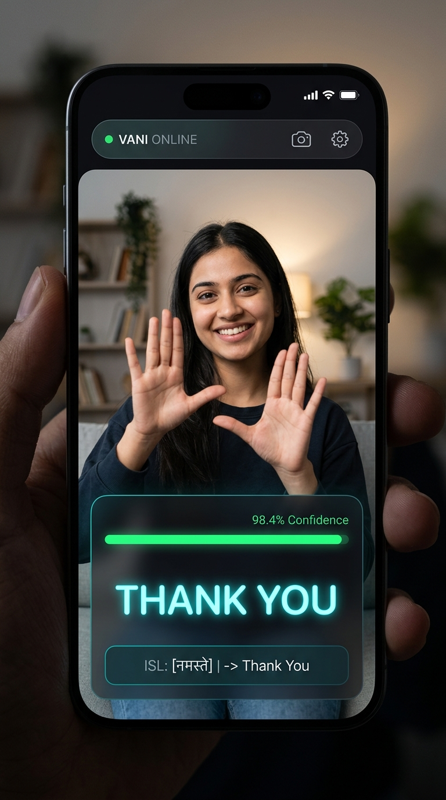

# Vani (वाणी) - Real-Time Sign Language Recognition & Translation System

<p align="center">
  
</p>

<p align="center">
  
  
  
  
  
  
  
  
</p>

---

## 🌟 Overview

**Vani** is an end-to-end, bi-directional sign language recognition and translation platform designed to empower seamless communication for the deaf and hard-of-hearing community. 

This repository contains the complete full-stack ML engine & mobile client:
1. **Task 1: Spatial-Temporal Feature Extraction**: Captures camera streams, extracts 543 multi-modal landmarks (Pose, Face, Hands) via MediaPipe, zero-pads missing points to shape `(1662,)`, and windows them into 30-frame temporal blocks `(30, 1662)`.
2. **Task 2: Deep Temporal LSTM Gesture Model**: Multi-layer LSTM neural network trained on sequence matrices, exported in both native `.keras` and `.h5` formats with dynamic real-time webcam inference.
3. **Task 3: High-Throughput Django REST Inference API**: Production-grade Django backend with memory-efficient model loading on startup, strict matrix shape validation, CORS configuration for Flutter, and low-latency `/api/translate/` endpoint.
4. **Task 4: Cross-Platform Flutter Mobile Application**: Real-time camera streaming, 30-frame rolling FIFO buffer, debounced API client, and a glassmorphic HUD with live confidence metrics and sentence builder.

---

## 📱 Flutter Mobile App (Task 4)

<p align="center">
  
</p>

The mobile application is built with **Flutter & Dart** (`vani_mobile/`) and provides:
- **Fullscreen Front-Camera Viewfinder**: Real-time image processing stream via `cameraController.startImageStream`.
- **Temporal Rolling Window Buffer**: Circular FIFO queue (`LandmarkBuffer`) holding exactly 30 frames with zero-padding fallback to guarantee `(30, 1662)` shape invariants.
- **Debounced HTTP API Client**: `ApiService` dispatches requests to `http://<BACKEND_IP>:8000/api/translate/` with a 1.2-second cooldown to prevent network congestion while keeping the UI responsive.
- **In-App Backend Settings Dialog**: Switch between Android Emulator (`10.0.2.2:8000`), Localhost, or Physical Wi-Fi IPs with live connection health checking.
- **Sentence Builder**: Real-time accumulated translation history with one-tap copy and clear actions.

---

## 📐 Matrix Dimensions & Geometric Breakdown

Each video frame is processed through **MediaPipe Holistic** to extract 3D Cartesian coordinates and visibility metrics:

| Landmark Modality | Landmark Count | Values per Landmark | Feature Vector Shape | Zero-Padding Fallback | Description |
| :--- | :---: | :---: | :---: | :---: | :--- |
| **Pose** | 33 | 4 $(x, y, z, \text{visibility})$ | `(132,)` | `np.zeros(132)` | Torso, shoulders, elbows, wrists |
| **Face Mesh** | 468 | 3 $(x, y, z)$ | `(1404,)` | `np.zeros(1404)` | Facial expressions & lip contours |
| **Left Hand** | 21 | 3 $(x, y, z)$ | `(63,)` | `np.zeros(63)` | Left finger joints & palm |
| **Right Hand** | 21 | 3 $(x, y, z)$ | `(63,)` | `np.zeros(63)` | Right finger joints & palm |
| **Total Frame Vector** | **543** | — | **`(1662,)`** | `np.zeros(1662)` | Concatenated 1D `float32` array |

- **Temporal Sliding Window**: 30 consecutive frames ($\approx 1$ second of continuous motion at 30 FPS).
- **Sequence Tensor Shape**: **`(30, 1662)`**
- **Batch Shape for Model Ingestion**: **`(1, 30, 1662)`**

---

## 📁 Repository Structure

```
vani/
├── assets/
│   ├── vani_preview.png              # AI Web/Desktop preview banner
│   └── vani_mobile_preview.png       # Flutter mobile application mockup
├── models/
│   ├── vani_gesture_model.keras      # Trained model weights (Keras 3 native format)
│   ├── vani_gesture_model.h5         # Trained model weights (H5 format for Django)
│   ├── best_vani_gesture_model.keras # ModelCheckpoint optimal weights
│   └── actions.json                  # Class index-to-label metadata mapping
├── vani_backend/                     # Django REST API Backend Root
│   ├── manage.py
│   ├── vani_backend/                 # Settings, CORS, URL dispatcher
│   └── api/                          # Apps singleton loader, views, serializers, tests
├── vani_mobile/                      # Flutter Mobile Application Root
│   ├── pubspec.yaml                  # Dependencies (camera, http, permission_handler)
│   ├── android/                      # AndroidManifest.xml permissions
│   ├── ios/                          # Info.plist camera permissions
│   └── lib/
│       ├── main.dart                 # App entry point & dark glassmorphic theme
│       ├── config/app_config.dart    # Server endpoints & buffer constants
│       ├── models/                   # TranslationResult JSON model
│       ├── services/                 # ApiService, LandmarkBuffer, FrameProcessor
│       └── screens/                  # CameraScreen, TranslationOverlay, SentenceBar
├── requirements.txt                  # Python dependencies
├── config.py                         # Pipeline constants & tensor shapes
├── landmark_extractor.py             # Dual-mode MediaPipe extractor (Tasks + Solutions)
├── sequence_buffer.py                # Circular temporal sliding window buffer (30, 1662)
├── collect_data.py                   # Interactive dataset recorder CLI with HUD
├── train_model.py                    # LSTM training pipeline & evaluation
├── realtime_inference.py             # Live webcam sign translator
├── test_pipeline.py                  # Pipeline verification test suite
└── test_api.py                       # Standalone API verification client
```

---

## 🚀 Quick Start Guide

### 1. Launch Django Backend API Server

```bash
# In the repository root:
python vani_backend/manage.py runserver 0.0.0.0:8000
```

### 2. Run the Flutter Mobile Application

```bash
cd vani_mobile

# Get packages
flutter pub get

# Launch on connected device or Android Emulator
flutter run
```

*(Tip: In the Flutter app, tap the top-right Settings icon to configure your computer's local Wi-Fi IP address if testing on a physical mobile device).*

### 3. Run Real-Time Desktop Webcam Inference

```bash
python realtime_inference.py
```

---

## 🛣️ Project Roadmap

- [x] **Task 1: Data Extraction & Preprocessing Pipeline** (MediaPipe Holistic + 30-Frame Sequence Buffer)
- [x] **Task 2: Temporal Model Training & Real-Time Inference** (TensorFlow / Keras LSTM)
- [x] **Task 3: Backend API** (Django REST Framework with memory-efficient model loader & CORS)
- [x] **Task 4: Cross-Platform Mobile App** (Flutter & Dart with real-time camera stream & HUD)
- [ ] **Task 5: 3D Avatar Rendering** (Three.js text-to-sign reverse translation)

---

## 📄 License

This project is licensed under the MIT License - see the [LICENSE](LICENSE) file for details.
