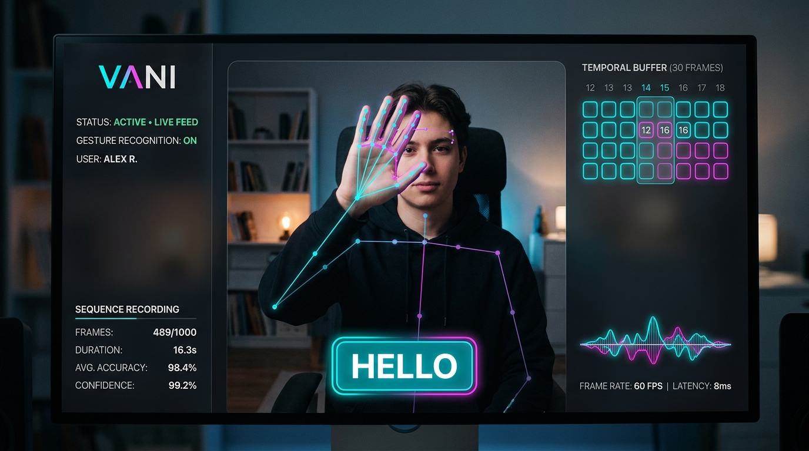

# Vani (वाणी) - Real-Time Sign Language Recognition & Translation System

<p align="center">
  
</p>

<p align="center">
  
  
  
  
  
  
  
</p>

---

## 🌟 Overview

**Vani** is an end-to-end, bi-directional sign language recognition and translation platform designed to empower seamless communication for the deaf and hard-of-hearing community. 

This repository contains the complete full-stack ML engine:
1. **Task 1: Spatial-Temporal Feature Extraction**: Captures camera streams, extracts 543 multi-modal landmarks (Pose, Face, Hands) via MediaPipe, zero-pads missing points to shape `(1662,)`, and windows them into 30-frame temporal blocks `(30, 1662)`.
2. **Task 2: Deep Temporal LSTM Gesture Model**: Multi-layer LSTM neural network trained on sequence matrices, exported in both native `.keras` and `.h5` formats with dynamic real-time webcam inference.
3. **Task 3: High-Throughput Django REST Inference API**: Production-grade Django backend with memory-efficient model loading on startup, strict matrix shape validation, CORS configuration for Flutter, and low-latency `/api/translate/` endpoint.

---

## 📐 Matrix Dimensions & Geometric Breakdown

Each video frame is processed through **MediaPipe Holistic** to extract 3D Cartesian coordinates and visibility metrics:

| Landmark Modality | Landmark Count | Values per Landmark | Feature Vector Shape | Zero-Padding Fallback | Description |
| :--- | :---: | :---: | :---: | :---: | :--- |
| **Pose** | 33 | 4 $(x, y, z, \text{visibility})$ | `(132,)` | `np.zeros(132)` | Torso, shoulders, elbows, wrists |
| **Face Mesh** | 468 | 3 $(x, y, z)$ | `(1404,)` | `np.zeros(1404)` | Facial expressions & lip contours |
| **Left Hand** | 21 | 3 $(x, y, z)$ | `(63,)` | `np.zeros(63)` | Left finger joints & palm |
| **Right Hand** | 21 | 3 $(x, y, z)$ | `(63,)` | `np.zeros(63)` | Right finger joints & palm |
| **Total Frame Vector** | **543** | — | **`(1662,)`** | `np.zeros(1662)` | Concatenated 1D `float32` array |

- **Temporal Sliding Window**: 30 consecutive frames ($\approx 1$ second of continuous motion at 30 FPS).
- **Sequence Tensor Shape**: **`(30, 1662)`**
- **Batch Shape for Model Ingestion**: **`(1, 30, 1662)`**

---

## 🌐 Django REST Inference API (Task 3)

The backend service is built with **Django 5.0+** and **Django REST Framework (DRF)**.

### Model Loading Optimization
Model weights (`models/vani_gesture_model.keras` / `models/vani_gesture_model.h5`) are loaded **once into memory upon Django server startup** via `api/apps.py` (`ApiConfig.ready()`), eliminating per-request loading overhead and providing **sub-15ms inference latency**.

### Endpoints:

#### 1. `POST /api/translate/`
Evaluates a 30-frame landmark coordinate sequence and returns the predicted sign action.

- **Request Body**:
```json
{
  "sequence": [
    [0.12, 0.45, 0.89, ... 1662 float values ...],
    ... 30 frames total ...
  ]
}
```

- **Response (`200 OK`)**:
```json
{
  "status": "success",
  "action": "hello",
  "confidence": 0.9842,
  "probabilities": {
    "hello": 0.9842,
    "thank_you": 0.0051,
    "yes": 0.0032,
    "no": 0.0021,
    "help": 0.0018,
    "please": 0.0024,
    "i_love_you": 0.0012
  },
  "sequence_length": 30,
  "latency_ms": 11.8
}
```

- **Error Response (`400 Bad Request`)**:
```json
{
  "status": "error",
  "message": "Invalid input matrix dimensions or malformed payload.",
  "errors": {
    "sequence": ["Invalid temporal sequence length: Received 15 frames, expected exactly 30."]
  },
  "expected_shape": "(30, 1662)"
}
```

#### 2. `GET /api/health/`
Returns service readiness, loaded model state, and registered actions.

#### 3. `GET /api/actions/`
Returns the list of supported sign language gestures.

---

## 📁 Repository Structure

```
vani/
├── assets/
│   └── vani_preview.png              # Interface screenshot & preview banner
├── models/
│   ├── vani_gesture_model.keras      # Trained model weights (Keras 3 native format)
│   ├── vani_gesture_model.h5         # Trained model weights (H5 format for Django)
│   ├── best_vani_gesture_model.keras # ModelCheckpoint optimal weights
│   └── actions.json                  # Class index-to-label metadata mapping
├── vani_backend/                     # Django Backend Project Root
│   ├── manage.py
│   ├── vani_backend/
│   │   ├── settings.py               # DRF, CORS, App configs
│   │   ├── urls.py                   # Root URL router -> /api/
│   │   ├── wsgi.py
│   │   └── asgi.py
│   └── api/                          # Django REST App
│       ├── apps.py                   # Model loading singleton on startup
│       ├── views.py                  # /api/translate/, /api/health/, /api/actions/
│       ├── serializers.py            # (30, 1662) matrix shape validator
│       ├── urls.py                   # API endpoint dispatcher
│       └── tests.py                  # Automated API test suite
├── requirements.txt                  # Python dependencies
├── config.py                         # Pipeline constants & tensor shapes
├── landmark_extractor.py             # Dual-mode MediaPipe extractor (Tasks + Solutions)
├── sequence_buffer.py                # Circular temporal sliding window buffer (30, 1662)
├── collect_data.py                   # Interactive dataset recorder CLI with HUD
├── train_model.py                    # LSTM training pipeline & evaluation
├── realtime_inference.py             # Live webcam sign translator
├── test_pipeline.py                  # Pipeline verification test suite
└── test_api.py                       # Standalone API verification client
```

---

## 🚀 Quick Start Guide

### 1. Setup Environment & Install Dependencies

```bash
git clone https://github.com/Souvik-Das-23/Vani.git
cd Vani

pip install -r requirements.txt
```

### 2. Run All Automated Verification Tests

```bash
# Test CV feature extractor & sequence buffer
python test_pipeline.py

# Test Django REST API endpoints & shape serializers
python vani_backend/manage.py test api
```

### 3. Launch Django Backend Server

```bash
python vani_backend/manage.py runserver 0.0.0.0:8000
```

### 4. Test API with Client Script or cURL

```bash
# Using the built-in test client:
python test_api.py

# Or via cURL:
curl -X GET http://127.0.0.1:8000/api/health/
```

### 5. Launch Real-Time Webcam Translation

```bash
python realtime_inference.py
```

---

## 🛣️ Project Roadmap

- [x] **Task 1: Data Extraction & Preprocessing Pipeline** (MediaPipe Holistic + 30-Frame Sequence Buffer)
- [x] **Task 2: Temporal Model Training & Real-Time Inference** (TensorFlow / Keras LSTM)
- [x] **Task 3: Backend API** (Django REST Framework with memory-efficient model loader & CORS)
- [ ] **Task 4: Cross-Platform Mobile App** (Flutter & Dart with real-time camera overlay)
- [ ] **Task 5: 3D Avatar Rendering** (Three.js text-to-sign reverse translation)

---

## 📄 License

This project is licensed under the MIT License - see the [LICENSE](LICENSE) file for details.
